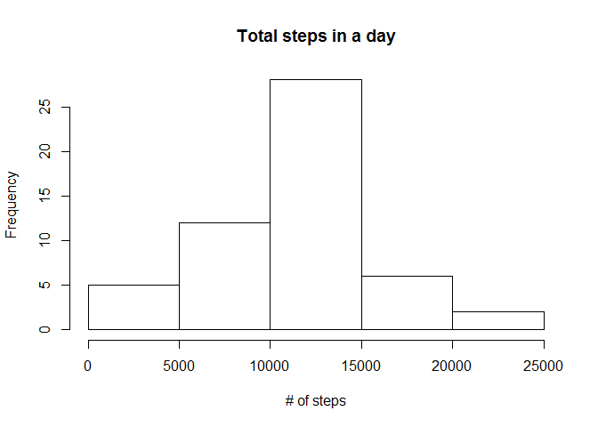

# Analyzing data from personal activity monitoring device

This device collects data for the months of October and November 2012, at 5 minute intervals through out the day

## Data Description
The variables included in this dataset are:

- steps: Number of steps taking in a 5-minute interval (missing values are coded as NA)
- date: The date on which the measurement was taken in YYYY-MM-DD format
- interval: Identifier for the 5-minute interval in which measurement was taken


## Reading the file


```r
data <- read.csv("activity.csv")
```

## What is mean total number of steps taken per day?

Estimate the total number of steps taken per day and plot an histogram of total steps taken


```r
sub_bydate <- summarize(group_by(data, date), total_steps = sum(steps))
hist((sub_bydate$total_steps), main = "Total steps in a day", xlab = "# of steps")
```

<!-- -->


```r
mean_steps <- round(mean(sub_bydate$total_steps, na.rm = TRUE),0)
median_steps <- round(median(sub_bydate$total_steps, na.rm = TRUE),0)
```

The mean of the total steps per day was 1.0766\times 10^{4} and the median was 1.0765\times 10^{4}.

## What is the average daily activity pattern?

Estimate the average number of steps taken by interval and plot a line chart against the time interval


```r
sub_byinterval <- summarize(group_by(data, interval), mean_steps = mean(steps, na.rm = TRUE))
with(sub_byinterval, plot(interval,mean_steps, type = "l", main = "Average steps taken by time interval"))
```

<!-- -->


```r
max_interval <- sub_byinterval[sub_byinterval$mean_steps == max(sub_byinterval$mean_steps),]
```

The maximum number of steps were taken in 835 time interval.

## Imputing missing values


```r
total_NAs <- sum(is.na(data$steps))
```

There are `r total_NAs' NAs in the data set.

### Strategy for imputting NAs
Any NAs for a given time interval is filled with the average number of steps taken druing that particular time interval across the period of the data. 


```r
data_mod <- data

total_rows <- nrow(data)
for (i in 1:total_rows) {
  if(is.na(data_mod[i,"steps"])) {
    data_mod[i, "steps"] <- sub_byinterval [sub_byinterval$interval == data_mod[i, "interval"],2]
  }
}
```

After replacing the NAs, plot a histogram with for total steps taken per day along with the new mean and median.


```r
sub_mod <- summarize(group_by(data_mod, date), total_steps = sum(steps))
mean_steps_mod <- round(mean(sub_mod$total_steps, na.rm = TRUE),0)
median_steps_mod <- round(median(sub_mod$total_steps, na.rm = TRUE),0)

hist((sub_mod$total_steps), main = "Total steps in a day with inputted data for NA",
     xlab = "# of steps", col = "blue")
abline(v= mean_steps_mod, col = "red", lty =1, lwd = 2)
abline(v= mean_steps_mod, col = "black", lty =2, lwd =2)
legend(x = "topright", c("Mean", "Median"), col = c("red", "black"), lty = c(2, 1), lwd = c(2, 2))
```

<!-- -->

The new mean of total steps taken is 1.0766\times 10^{4} and median is 1.0766\times 10^{4}.

## Are there differences in activity patterns between weekdays and weekends?


```r
data2_mod <- data_mod
data2_mod [,"date"] <- ymd(as.Date(data2_mod[,"date"]))
Days <- vector(mode = "character", length = total_rows)
for (i in 1:total_rows) {
  if(weekdays(data2_mod[i,"date"]) %in% c("Saturday","Sunday")) {
    Days[i] <- "Weekend"
  } else {
    Days[i] <- "Weekday"
  }
}

data2_mod[,"Days"] <- Days

sub_byDays <- summarize(group_by(data2_mod, interval, Days), mean_steps = mean(steps))

xyplot(sub_byDays$mean_steps ~ sub_byDays$interval|sub_byDays$Days, 
       main="Average Steps per Day by Interval",xlab="Interval", ylab="Steps",layout=c(1,2), type="l")
```

<!-- -->
